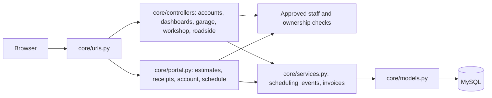

# AutoNexa architecture

AutoNexa is a server-rendered Django application with progressive JavaScript enhancements. MySQL stores application data; isolated tests and the UI preview use disposable SQLite databases.

`core/views.py` retains route-compatible exports. Forms validate appointments, estimate items and profile changes. Lists use `core/pagination.py`; filters in the staff dashboard apply to the visible page. Related objects are eagerly loaded on the main lists. Three.js loads only on pages that use vehicle visuals.

## Service lifecycle

1. A customer requests a service. Only active, approved and available staff participate in automatic allocation.
2. The assigned technician schedules a duration within workshop hours, weekly shifts and time off. Overlapping appointments are rejected.
3. The technician sends an itemized estimate. A revision supersedes earlier approval; the customer must approve the current version before new work starts.
4. Progress updates produce timestamped events with an actor. Completion requires a service record and a total matching the approved estimate.
5. Completion creates an immutable receipt snapshot of the customer, vehicle, items and amount. A receipt records charges; the app does not process or certify payment.

Pre-existing bookings keep their legacy completion path until an estimate is issued. Earlier historical activity is not invented or backfilled. Notifications link to their related service or roadside request.

## Access and concurrency

Staff mutations require both approval fields and an active user. Customers can only access their own work orders and receipts. Assigned staff can access their jobs. Multi-record changes use transactions. Appointment scheduling locks the staff row; roadside claims lock the request row. The MySQL CI job tests two simultaneous claims because SQLite cannot validate MySQL row-lock behavior.

## Visual system

The existing homepage identity remains the reference: dark surfaces, crimson actions and gold accents. `brand.css` owns the wordmark; `product.css` provides the new forms, timeline, tables, pagination and print layout. `roadside.css` and `roadside.js` provide the guided customer assistance flow. Service updates are visible on refresh; location tracking depends on the coordinates supplied by the users.
