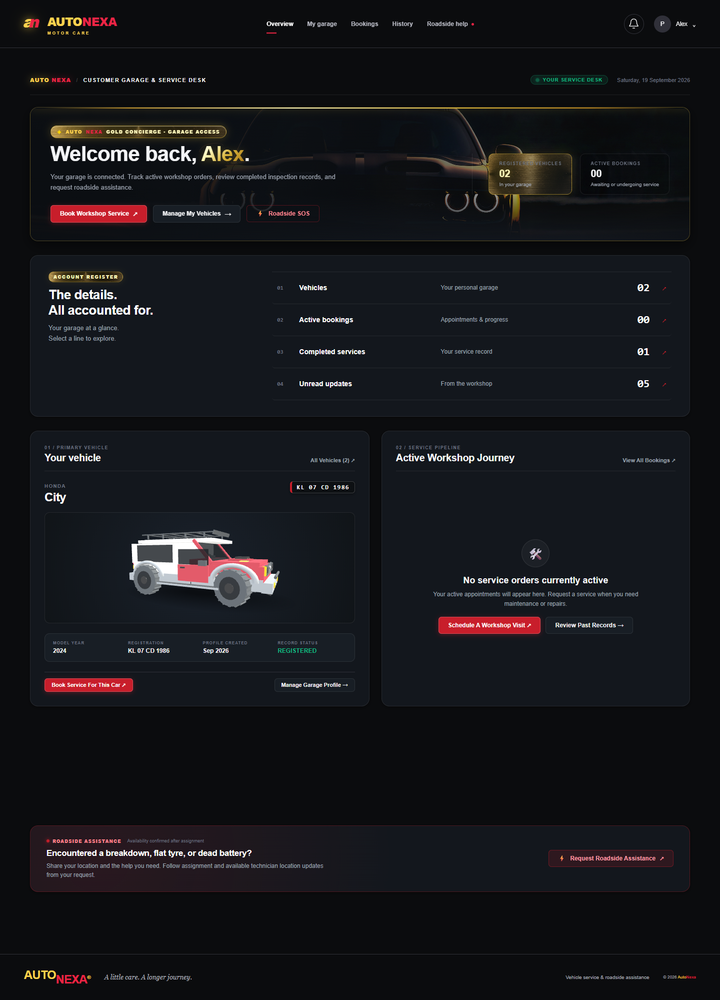
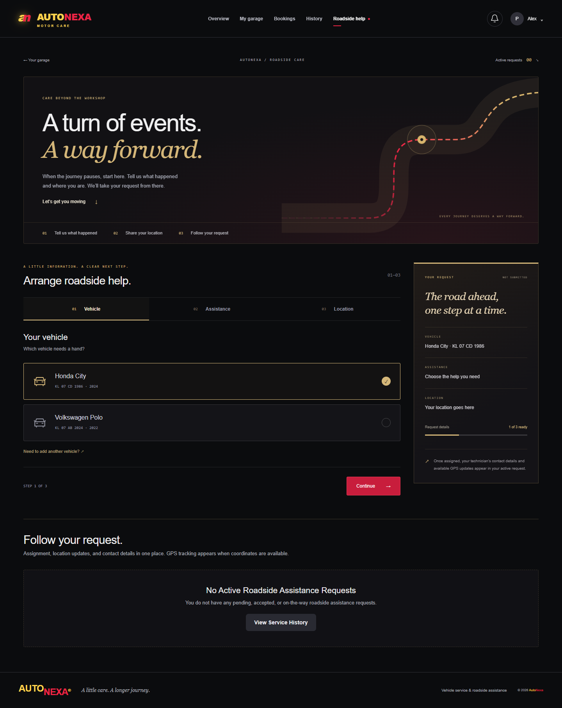
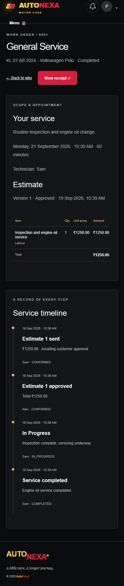

# Demonstrating AutoNexa

## Disposable visual preview

```sh
python tools/preview_ui.py
```

This creates synthetic data in memory and never opens the application's configured MySQL database. Open `http://127.0.0.1:8765/dashboard/?preview_role=customer` or `/staff-dashboard/?preview_role=staff`. Stop the process to discard the data. This preview bypasses login and must only run locally.

## Development demo accounts

After applying migrations, set `AUTONEXA_DEMO_PASSWORD` to a development-only password of at least 12 characters and run:

```sh
python manage.py seed_demo
```

The command requires DEBUG mode and creates `demo_customer`, `demo_technician`, and `demo_pending`. It includes two vehicles, an estimate awaiting approval, a completed service with a receipt, and a roadside request. If any demo username already exists, it leaves all records unchanged.

## Presentation path

1. Sign in as the customer and open a service from the dashboard or bookings list.
2. Review and approve the itemized estimate. Show the timestamped timeline.
3. Sign in as the technician, open the same work order, update progress and complete it with the approved total.
4. Return to the customer and print the receipt. Show the prior service history.
5. Walk through the roadside vehicle, issue and location steps. Show manual location entry when GPS is unavailable.
6. Show staff approval in the admin, schedule/leave configuration, account settings and the password reset screen.

## Automated browser checks

Start a fresh disposable preview before each run:

```sh
npm install
npx playwright install chromium
npm run test:browser
```

The script checks the estimate-to-receipt journey and desktop/mobile layouts. Screenshots are saved in `test-results/`. It accepts `PREVIEW_URL`, `BROWSER_CHANNEL`, `PLAYWRIGHT_MODULE`, and `SCREENSHOT_DIR` for local environments. CI uploads the screenshots as an artifact.

## Preview captures

These screenshots use synthetic data from the disposable preview.






